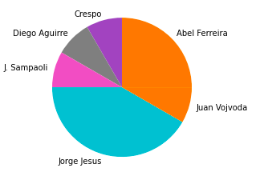
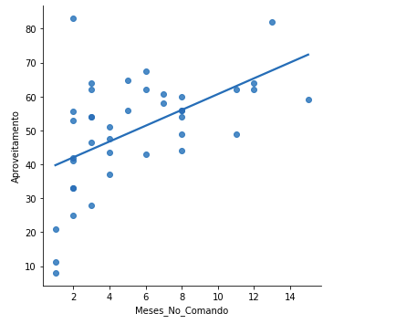

# Analise dos treinadores estrangeiros na elite do futebol brasileiro

Com o avanço do mercado de treinadores estrangeiros no futebol brasileiro, resolvi explorar este fenómeno um pouco mais afundo. 

**Nesta análise** utilizarei as seguintes ferramentas:

- Sqlite3
- Python e Bibliotecas(Pandas e Matplotlib)
- Jupyter Notebook

Você poderá ter acesso ao Dataset no meu [Github](https://tareqdandachi.github.io/jekyll-shell-theme).

## Mãos a obra!

Importando as bibliotecas necessarias:

    import sqlite3 as sql
    import pandas as pd
    import matplotlib.pyplot as plt
    import seaborn as sns
    %matplotlib inline

Conectar o BD sqlite ao Pandas:

    conn = sql.connect('treinadores.db')
    treinadores = pd.read_sql('SELECT * FROM treinadores', conn)

Lendo uma amostra do dataset:

    treinadores.head(n=6)

Renomear algumas colunas:

    treinadores = treinadores.rename(columns={'Mesesnocomando': 'Meses_No_Comando'})
    treinadores = treinadores.rename(columns={'Títulos': 'Titulos'})

Preparação dos dados:

    treinadores = treinadores.replace({',': '.'}, regex=True)

Comandos para remover outliers do dataset:

    treinadores.duplicated()
    treinadores.dropna() 
    treinadores.fillna() 

Procurando problemas nas variaveis 

    treinadores.dtypes

Converter 'Aproveitamento' de objeto p/ ponto flutante: 

    treinadores["Aproveitamento"] = treinadores["Aproveitamento"].astype(str).astype(float)

Conferindo:

    treinadores.dtypes

Conferindo o resultado das transformações:

    treinadores.head()

Anos com o maior nº de treinadores ao longo do tempo:

    treinadores["Ano"].value_counts().sort_values().
    plot.bar(title="Ano com o maior nº de treindadores")

Nacionalidade:

    treinadores["Nacionalidade"].value_counts().plot.pie(ylabel='')

Treinador:
  
    treinadores["Treinador"].value_counts().sort_values().plot.bar(title="Treinador")

Treinadores:

     treinadores["Time"].value_counts().sort_values()
     .plot.bar(title="Clubes com o maior nº de Treinadores")

Aproveitamento:

    df = pd.DataFrame(treinadores,columns=['Treinador','Aproveitamento'])
    ax = df.plot.bar(x = 'Treinador', y= 'Aproveitamento')

Titulos:

    treinadores["Titulos"].value_counts().sort_values().plot.bar(ylabel='')

Treinadores:
    df = pd.DataFrame(treinadores,columns=['Treinador','Titulos'])
    df.groupby(['Treinador']).sum().plot(kind='pie', y='Titulos', ylabel='')
    plt.legend().remove()

rsrsrs:

    df = pd.DataFrame(treinadores,columns=['Treinador','Meses_No_Comando'])
    ax = df.plot.bar(x = 'Treinador', y= 'Meses_No_Comando')

rsrsrs:

     treinadores = pd.DataFrame(treinadores,columns=['Meses_No_Comando','Aproveitamento'])
     df = pd.DataFrame(treinadores);
     _= sns.lmplot(x = 'Meses_No_Comando', y= 'Aproveitamento', data=df, ci=None)

rsrsrs:
    treinadores = pd.DataFrame(treinadores,columns=
    ['Meses_No_Comando','Aproveitamento'])
    df = pd.DataFrame(treinadores);
    _= sns.lmplot(x = 'Meses_No_Comando', 
    y= 'Aproveitamento', data=df, ci=None) 

ree:
   treinadores = pd.DataFrame(treinadores,columns=
   ['Aproveitamento', 'Titulos'])
   df = pd.DataFrame(treinadores);
   _= sns.lmplot(x = 'Aproveitamento', 
   y= 'Titulos', data=df, ci=None)

fechando o banco de dados:
  
    conn.close()

## License

The theme is available as open source under the terms of the [MIT License](https://opensource.org/licenses/MIT).
