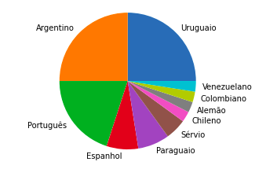
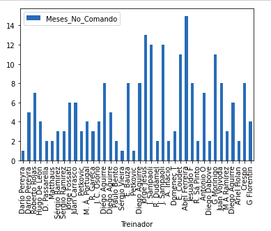

---
title: Portfolio by Dionatan Resende
---

# Analise dos treinadores estrangeiros na elite do futebol brasileiro

Com o avanço do mercado de treinadores estrangeiros no futebol brasileiro, resolvi explorar este fenómeno um pouco mais afundo. 

**Nesta análise** utilizarei as seguintes ferramentas:

- Sqlite3
- Python e Bibliotecas(Pandas e Matplotlib)
- Jupyter Notebook

Você poderá ter acesso ao Dataset no meu [Github](https://github.com/dionatandiego11/Datasets/blob/9be198537b84862ec799c4582746ef00424d5b85/treinadores.csv).

## Mãos a obra!

Primeiramente vamos importar as bibliotecas necessarias

```python 

    import sqlite3 as sql
    import pandas as pd
    import matplotlib.pyplot as plt
    import seaborn as sns
    %matplotlib inline
```

Em seguida vamos conectar o Banco de Dados ao Pandas:
```python 
conn = sql.connect('treinadores.db')
treinadores = pd.read_sql('SELECT * FROM treinadores', conn)
```
Agora vamos pegar uma amostra do dataset:
```python 
treinadores.head(n=6)
```


Já é possível perceber alguns problemas no dataset, como a má codificação do cabeçalho 

Então vamos renomear algumas colunas que estão má codificadas: 
```python 
treinadores = treinadores.rename(columns={'Mesesnocomando': 'Meses_No_Comando'})
treinadores = treinadores.rename(columns={'Títulos': 'Titulos'})
```
Neste passo vamos continuar preparando os dados
```python 
treinadores = treinadores.replace({',': '.'}, regex=True)
```
Comandos para encontrar e remover outliers do dataset, caso necessario:
```python 
    #treinadores.duplicated()
    #treinadores.dropna() 
    #treinadores.fillna() 
```
Procurando problemas nas variaveis: 
```python 
treinadores.dtypes
```


Converter 'Aproveitamento' de objeto p/ ponto flutante: 
```python 
treinadores["Aproveitamento"] = treinadores["Aproveitamento"].astype(str).astype(float)
```
Conferindo:
```python 
treinadores.dtypes
```


Conferindo o resultado das transformações:
```python 
treinadores.head()
```


Anos com o maior nº de treinadores ao longo do tempo:
```python 
treinadores["Ano"].value_counts().sort_values().plot.bar(title="Ano com o maior nº de treindadores")
```


Nacionalidade:
```python 
treinadores["Nacionalidade"].value_counts().plot.pie(ylabel='')
```


Treinador:
```python 
treinadores["Treinador"].value_counts().sort_values().plot.bar(title="Treinador")
```


Treinadores:
```python 
treinadores["Time"].value_counts().sort_values().plot.bar(title="Clubes com o maior nº de Treinadores")
```


Aproveitamento:
```python 
df = pd.DataFrame(treinadores,columns=['Treinador','Aproveitamento'])
ax = df.plot.bar(x = 'Treinador', y= 'Aproveitamento')
```


Titulos:
```python 
treinadores["Titulos"].value_counts().sort_values().plot.bar(ylabel='')
```


Treinadores com mais títulos:
```python 
df = pd.DataFrame(treinadores,columns=['Treinador','Titulos'])
df.groupby(['Treinador']).sum().plot(kind='pie', y='Titulos', ylabel='')
plt.legend().remove()
```


Treinadores com mais meses no comando:
```python 
df = pd.DataFrame(treinadores,columns=['Treinador','Meses_No_Comando'])
ax = df.plot.bar(x = 'Treinador', y= 'Meses_No_Comando')
```


Correlação entre Aproveitamento e Meses no comando:
```python 
treinadores = pd.DataFrame(treinadores,columns=['Meses_No_Comando','Aproveitamento'])
df = pd.DataFrame(treinadores)
_= sns.lmplot(x = 'Meses_No_Comando', y= 'Aproveitamento', data=df, ci=None) 
```


Correlação entre Aproveitamento e títulos:
```python 
treinadores = pd.DataFrame(treinadores,columns=['Aproveitamento', 'Titulos'])
df = pd.DataFrame(treinadores)
_= sns.lmplot(x = 'Aproveitamento',y= 'Titulos', data=df, ci=None)
```


fechando o banco de dados:
```python 
    conn.close()
```
## License

The theme is available as open source under the terms of the [MIT License](https://opensource.org/licenses/MIT).
