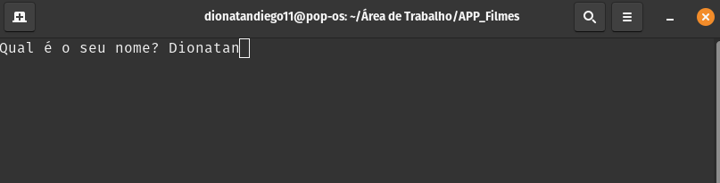
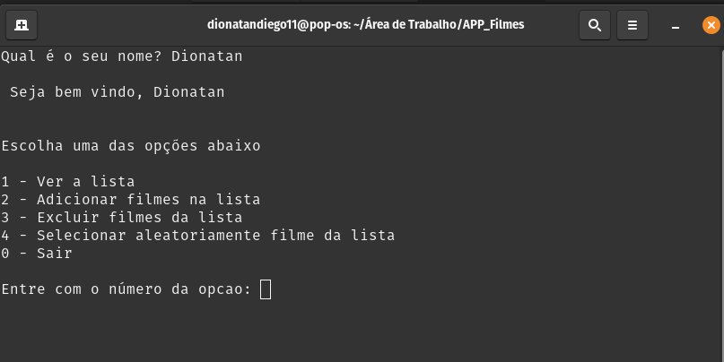

# App para selecionar Filmes a partir de uma lista

Você uma pessoa que pega várias indicações de filmes para assistir e no momento que tira um tempinho para faze-lo fica em dúvida? Foi com esse intuito que resolvi escrever este pequeno app, onde poderá jogar toda sua lista e o app simplesmente vai selecionar pelo acaso um filme da lista que você disponibilizou, simples e fácil de utilizar.

# Screenshot

## O aplicativo foi escrito em python e no momento só poderá ser utilizado via comando no terminal.

O Download do app poderá ser feito em [/Github/app/app_filme](https://github.com/dionatandiego11/apps/raw/main/APP_Filmes.tar.gz).

## License

The theme is available as open source under the terms of the [MIT License](https://opensource.org/licenses/MIT).
