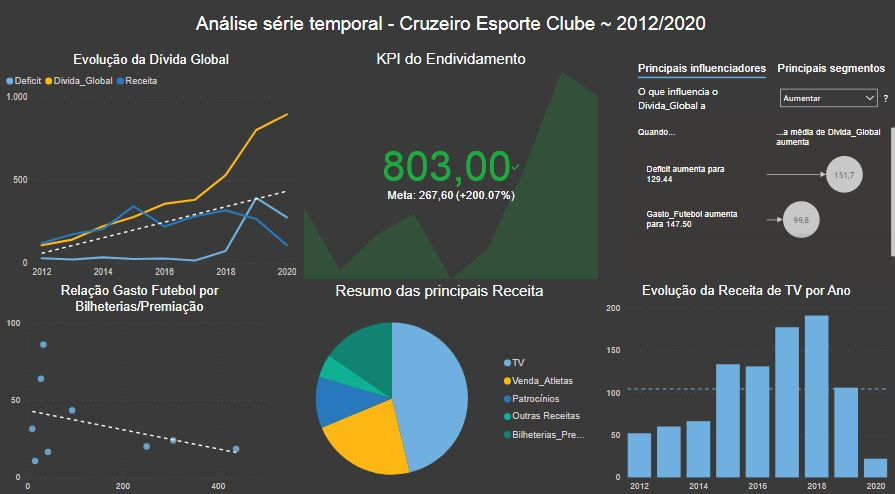

# Analise do balanço financeiro do Cruzeiro Esporte Clube

**Nesta análise** chegamos ao seguinte resultado:

-A agressividade da dívida global.
- A co-relação entre Gasto com futebol e retorno Bilheteria/Prêmio
- A maior fonte de receita do clube(cotas de televisão), caiu substancialmente após 2018, intensificando ainda mais a situação caótica do endividamento global.

Você poderá ter acesso ao Dataset no meu [Github](https://github.com/dionatandiego11/Datasets/blob/main/Balanco_Op.csv).

# Observação, os dados foram retirados dos anos 2003 ~ 2021, infelizemnte não estão "ajustados", as informações podem ser encontradas in loco em: https://lnkd.in/d4u6QRua 

## License

The theme is available as open source under the terms of the [MIT License](https://opensource.org/licenses/MIT).
