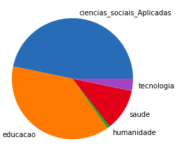

# Analise sobre o censo do ensino superior EAD no Brasil

Com o avanço do mercado de ensino superior ead brasileiro, resolvi explorar este fenómeno um pouco mais afundo. 

**Nesta análise** utilizarei as seguintes ferramentas:

- Python e Bibliotecas(Pandas, Seaborn e Matplotlib)
- Jupyter Notebook

Você poderá ter acesso ao Dataset no meu [Github](https://github.com/dionatandiego11/Datasets/blob/9be198537b84862ec799c4582746ef00424d5b85/ead.csv).

# Observação, os dados foram retirados entre os anos de 2017 ~ 2020, do site do INEP (inep.gov.br), por fim, só foram considerados os cursos de instituições privadas.

Primeiramente, observamos o aumento das matriculas nos cursos superiores ead ao longo dos anos e a consequencia de que em 2020 a ultrapassagem dos matriculados no ensino superior ead pelo presencial.

No próximo gráfico observamos a repartição dos cursos em seu grau(Bacharelado, Licenciatura e Tecnologo)

Agora a sepração por "eixo de conhecimento".

Neste momento vemos os cursos separados por Matriculas repartido em anos, ou seja, as matriculas feitas em 2017, 18... É interessante perceber que alguns cursos monopolizam, com destaque para o curso de Pedagogia que "sobra", mas há uma tendencia de uma melhor distribuição, ao longo do tempo.

A observação anterior é exemplificada melhor na próxima imagem.

Uma melhor vizualização para o grafico anterior.

Agora o número de matriculas separadda pelo eixo de conhecimento.

No próximo gráfico, observa-se a tendência de matriculas por "eixo" e "grau acadêmico", há uma estabilização das matriculas dos cursos Tecnologos, aumento forte nos cursos de Licenciatura e queda dos matriculados no Bacharelado.

Na próxima analise eu busquei os cursos superiores mais buscados no Google entre 2017~2020 e comparei com a taxa de matriculados, percebe-se por exemplo que o curso de "Administração" está estabilizado ao longo do tempo.

Por fim, fiz uma co-relação entre a pesquisa do Google o número de matricula, claro que quanto o maior interesse(buscas no Google), maior o número de matricula no curso.

# Conclusão

Concluindo está analise com a percepção de que os cursos superiores no formato EAD estão se homogenizando e se diversificando, as matriculas estão saindo devagar do "monopolio" de alguns cursos visados para uma melhor distribuição no grande leque que existe. E claro, a tendencia de que os professores serão em grande maioria formados pelo formato.

## License

The theme is available as open source under the terms of the [MIT License](https://opensource.org/licenses/MIT).
