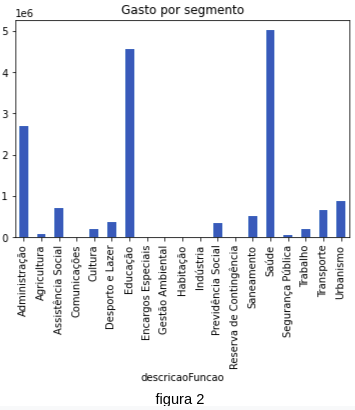
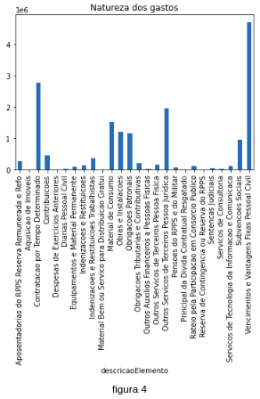
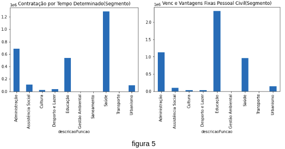
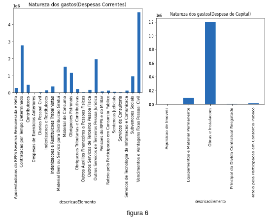

# Análise sobre Despesas por Programas e Ações da prefeitura de Itaguara-MG

**Nesta análise** utilizarei as seguintes ferramentas:

- Python e Bibliotecas(Pandas, Seaborn e Matplotlib)
- Jupyter Notebook

**Introdução** Segundo a Wikipédia, Itaguara é um município do estado de Minas Gerais, no Brasil. Pertence à Região Metropolitana de Belo Horizonte. A sede do município está localizada a 95 quilômetros de Belo Horizonte. População estimada em 13.510 pessoas

Os dados utilizados neste estudo podem ser encontrados em: [transparencia.betha.cloud](https://transparencia.betha.cloud/#/sRHY4sDC5tFC_luEwJr_Wg==/dados-abertos).

# Observação, os dados foram retirados na seguinte data: 1/06/2022, como o dataset são atualizados constantemente, quando está análise for publicada o dataset utilizado já estará defasado.

# Observação 2, este projeto não tem por finalidade ativismo político e se trata única e exclusivamente de estudo de caso orientado ao meu desenvolvimento profissional.

Como não sou especialista em políticas públicas, analisar estes dados me trouxeram verdadeiros desafios, como alguns conceitos que não conhecia, etc.

Primeiramente como esta análise é focada em gastos e despesas me deparei com os seguintes discriminação:  Valor Empenhado, valor Liquidado, valor a Liquidar, valor Pago, valor a Pagar Empenhado, valor a Pagar Liquidado. Em uma análise mais complexa esses dados deveriam ser considerados, mas nesta análise vamos concentrar apenas a variável “Valor pago”.

Inicialmente observamos na figura 1 a categoria econômica(classificação das receitas e despesas em operações correntes ou de capital, objetivando propiciar elementos para uma avaliação do efeito econômico das transações do setor público).

Contextualizando o que é despesa corrente e de Capital.

**Despesas Correntes**: Gastos de manutenção e funcionamento dos serviços públicos em geral que não contribuem, diretamente, para a formação ou aquisição de um bem de capital. São exemplos: vencimentos e encargos com pessoal, juros da dívida, compra de matérias-primas e bens de consumo, serviços de terceiros, manutenção de equipamentos, subvenções a entidades (para gastos de custeio) e transferência a entes públicos (para gastos de custeio). [congressonacional.leg.br](https://www.congressonacional.leg.br/legislacao-e-publicacoes/glossario-orcamentario/-/orcamentario/termo/despesa_corrente#:~:text=Gastos%20de%20manuten%C3%A7%C3%A3o%20e%20funcionamento,de%20um%20bem%20de%20capital).

**Despesa de Capital**: Gastos para a produção ou geração de novos bens ou serviços que integrarão o patrimônio público, ou seja, que contribuem diretamente para a formação ou aquisição de um bem de capital. [congressonacional.leg.br](https://www.congressonacional.leg.br/legislacao-e-publicacoes/glossario-orcamentario/-/orcamentario/termo/despesa_de_capital#:~:text=Despesa%20de%20Capital-,Termo%3A%20Despesa%20de%20Capital,de%20um%20bem%20de%20capital).

A maior parte dos gastos são direcionados para manter a máquina pública operacional. No gráfico 2 temos os gastos segmentados de forma global, ou seja, tanto gastos correntes quanto gastos de capitais.

Observa-se que Saúde, Educação e Administração levam 75.5% do total das verbas públicas gastas.

Na figura 3 temos a origem das receitas discriminado por secretaria.

Agora vamos colocar uma lupa sobre a Natureza dos gastos, a figura 4 temos uma perspectiva descritiva.

Os dois gastos que mais saltam aos olhos são: Contratação por Tempo Determinado e Vencimentos e Vantagens fixas que juntos somam quase 50% dos gastos totais, 48,89%.
 
**Contratação por Tempo Determinado**: despesas com contratação de pessoal por tempo determinado para atender a necessidade temporária de excepcional interesse público, de acordo com a Lei complementar nº 1.093, de 16 de julho de 2009, inclusive obrigações patronais e outras despesas variáveis, quando for o caso.[fazenda.sp.gov.br](https://www.fazenda.sp.gov.br/sigeolei131/paginas/arquivoslc/lc_131_despesas.pdf).

**Vencimentos e Vantagens fixas**:  Pessoal Civil: despesas com subsídios, vencimentos ou remunerações e vantagens do Pessoal Civil, regimes especiais de trabalho, adicionais por tempo de serviço, sexta-parte, pró-labore, gratificação, cumulação de cargos ou funções de execução ou pela prestação de serviços de natureza especial devida aos membros do Ministério Público prevista na Lei Complementar Estadual nº 734 de 26 de novembro de 1993, abonos, quotas, porcentagens fiscais, prêmios de produtividade, salário de pessoal regido pela Consolidação das Leis Trabalhistas (CLT), e outras despesas decorrentes de pessoal em serviço na entidade. Incluem-se as despesas relativas ao pagamento dos valores atrasados decorrentes da aplicação das Leis Federais nºs 10.474, 10.475 e 10.477, de 27 de junho de 2002, sobre a diferença de vencimentos, férias pagas em pecúnia, licença prêmio paga em pecúnia, 13º salário, cumulação, 1/3 de férias, entre outros. Pagamentos relativos a indenizações de férias de exercícios diversos efetuados pelo Poder Judiciário e Ministério Público. [fazenda.sp.gov.br](https://www.fazenda.sp.gov.br/sigeolei131/paginas/arquivoslc/lc_131_despesas.pdf).

Então na figura 5 vamos segmentar ambas as informações.

Continuando na figura 6, observamos a Natureza dos gastos também segmentado por Despesa corrente  e Despesa de Capital.

Para finalizarm, vamos observar a Natureza dos 3 principais gastos:Saúde(figura 8), Educação(figura 9) e administração(figura 10).

# Conclusão

É interessante notar o auto custo operacional da máquina pública e o dispêndio financeiro em áreas chenves como a administração pública, para estudos futuros analisarei o o fluxo de caixa em função do tempo para ter uma noção global e embasada da tomada de decisão do poder executivo local.

## License

The theme is available as open source under the terms of the [MIT License](https://opensource.org/licenses/MIT).
