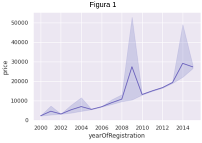
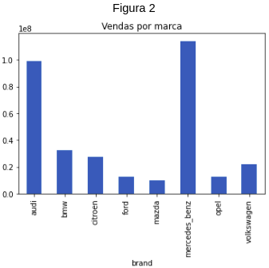
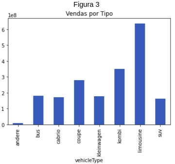
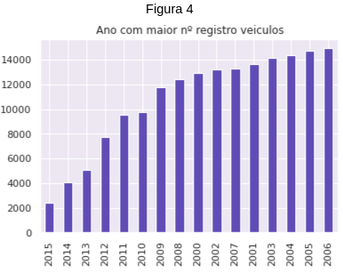
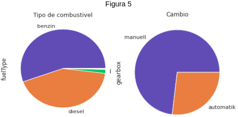
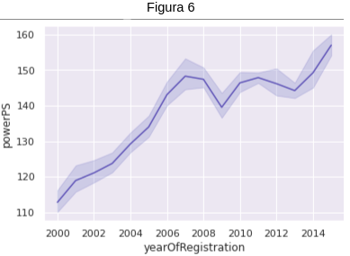

# Análise sobre o mercado de veiculos norte-americano

**Nesta análise** utilizarei as seguintes ferramentas:

- Python com Bibliotecas
- Jupyter Notebook

**Introdução** Nesta análise farei uma análise do mercado automotivo norte-americano entre os anos de 2000 à 2015.

Os dados utilizados neste estudo podem ser encontrados em: [Kaggle](https://www.kaggle.com/datasets/toramky/automobile-dataset).

# Os dados são relacionados ao registro público.

No gráfico 1, vamos observar o preço médio dos veículos ao longo dos anos.

É interessante notar os picos e tendência de crescimento.

No 2º gráfico, analisando as marcas com maior performace em vendas(com um intervalo maior de 1e5)

Agora na figura 3, observamos o tipo de veículo mais vendido.

Em seguida observamos no gráfico 4 os anos com melhores maior quantidade de registros.

No gráfico 5, explicita-se o combustível e o método de câmbio. 

Por fim, na figura 6, observamos o aumento de potência ao longo dos anos.

## License

The theme is available as open source under the terms of the [MIT License](https://opensource.org/licenses/MIT).
